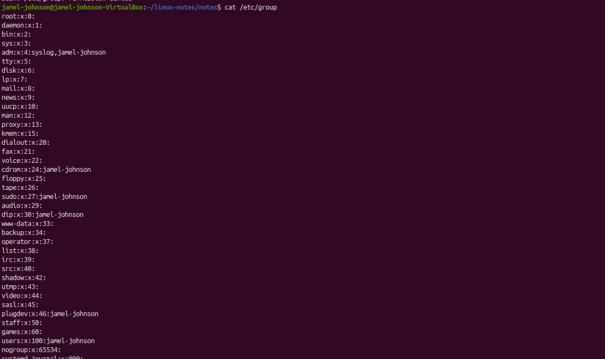
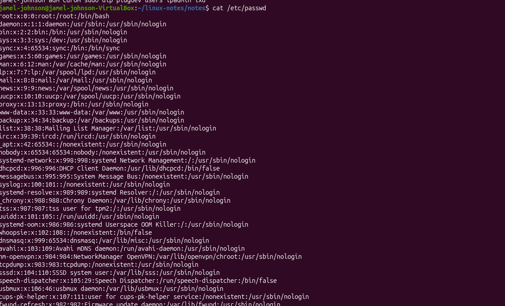

## Day 12 Users and Groups

##Commands Used
whoami
id
groups
cat /etc/passwd
cat /etc/group

## What I Did
-checked my current username
-viewed user and group information
-listed group memberships
-viewed local user accounts
-examined local group definitions

## What I Learned

whoami
-Displays current logged in user

id
-Displays user IDs and group IDs

groups
-displays group membership

cat /etc/passwd
-stores information about local user account

cat /etc/group
-stores information about local groups
-defines group names, group ids, and group memebers

## Screenshots

