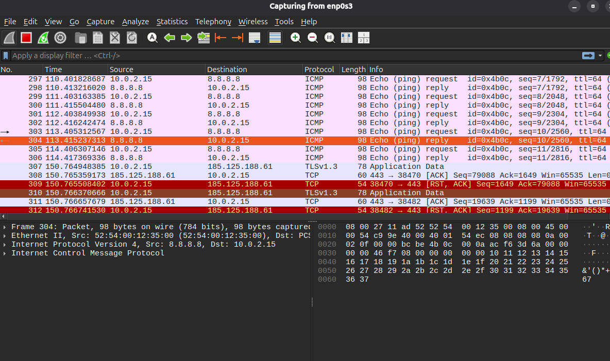

## Day 13 - Wireshark Basic

## Commands Used
sudo apt install wireshark
wireshark
ping 8.8.8.8

## What I Did
- Installed Wireshark
- Opened the application
- Started a packet capture
- Generated network traffic using ping
- Examined captured packets

## What I learned

Wireshark
-Captures network traffic in real time
-Allows inspection of individual packets

Packet Capture
-Shows communication between devices
-Includes source IP, destination IP, protocol, and package size

Ping
-Generated network traffic that appeared in Wireshark

## Screenshot

