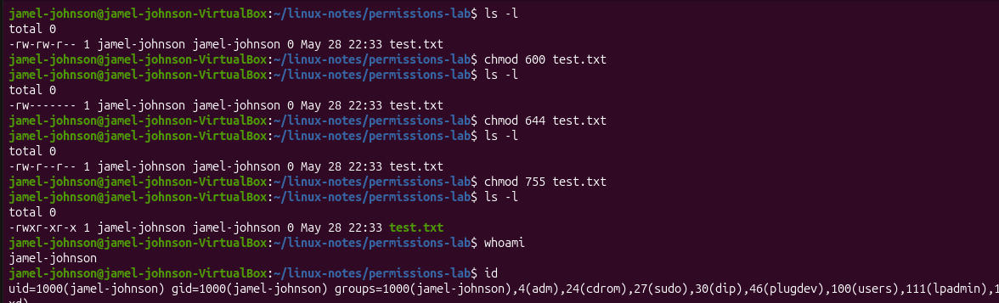

# Day 2 - Linux Permissions

## Commands Learned
-ls -l 
-chmod
-whoami
-id

# What I did
Created a test file and changed permissions
View file permissions using ls -l
Changed permissions using chmod
Checked my username with whoami
Check my user groups with id

## What I Learned
ls -l lets me see the permission for the file
600 = owner can read/write
644 = owner can read/write, others can read
755 = owner can read/write/execute, others

## Screenshots 

 
