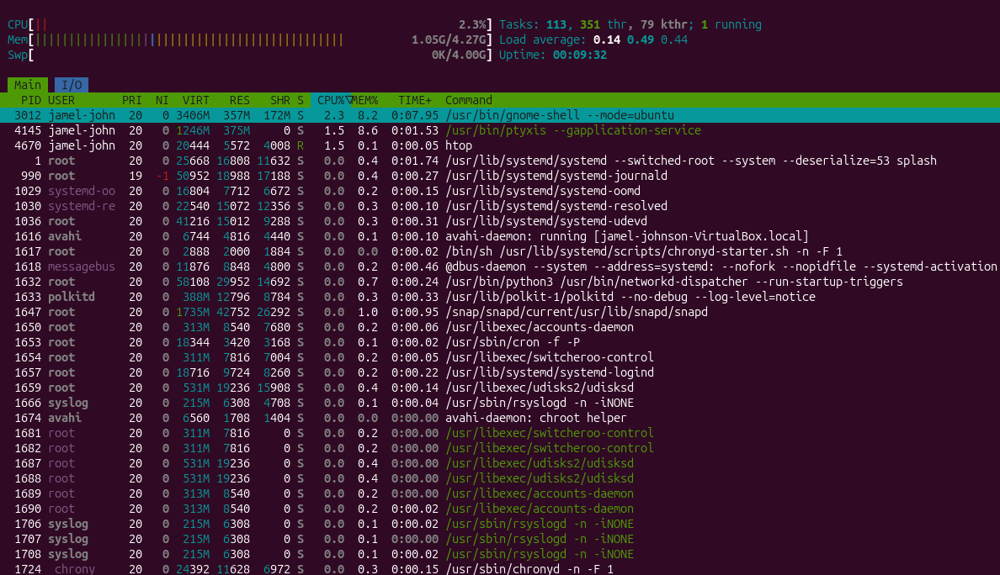

## day 3 - Package management Lab

## Commands learned
-sudo apt upgrade
-sudo apt upgrade
-sudo apt install htop
-htop

## What I did
- Updated Ubuntu package lists using 'apt update'
- Upgraded installed software using apt upgrade
- installed the htop package
- opened htop to monitor system resources

## What I learned
-Sudo
 - allows me to run commands with adminstrator privileges
-apt update 
 -Downloaded the latest information about available software and updates
 -Did not install any software
-apt upgrade
 -installed updates for software already on my system
 -used package information downloaded by apt update
-atp install htop
 -Downloaded, installed, and added htop package/command to my system
-htop
 -Displayed CPU usage
 -Displayed memory usage
 -Displayed running processes  
## Screenshots

