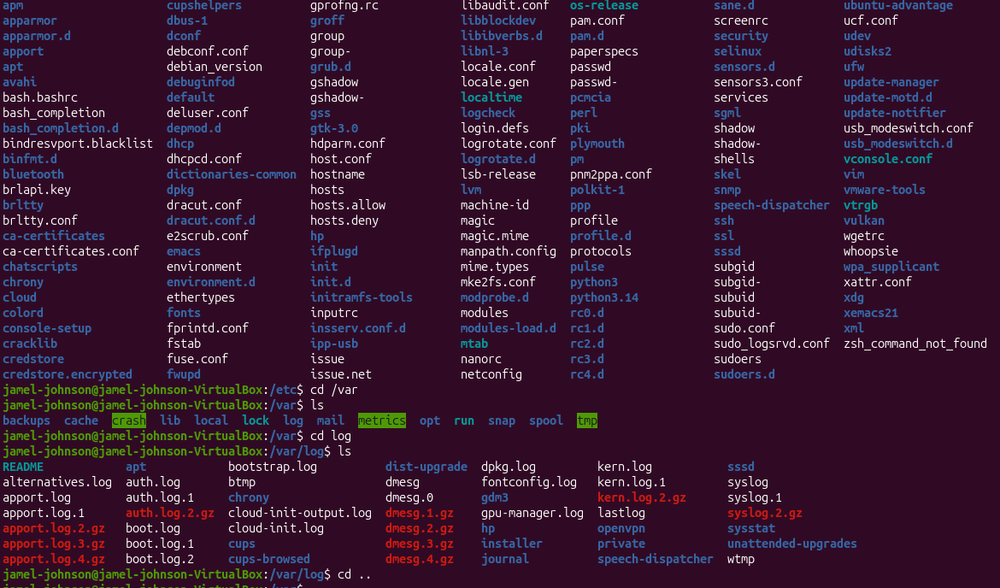
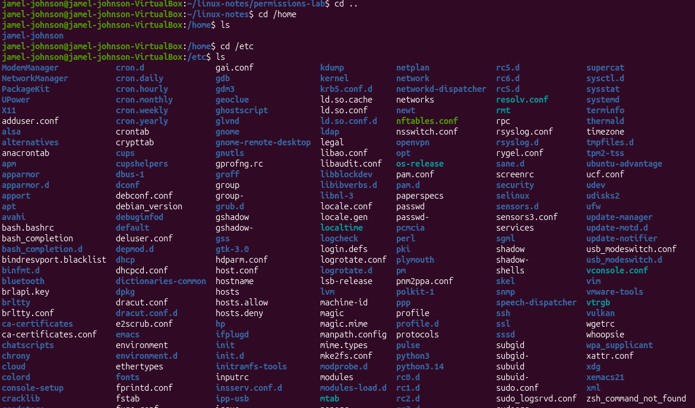

## Day 4 - Linux File system Navigation

## Commands Used
-Cd /
-ls
-cd /home
-cd /etc
-cd /var
-cd /tmp
-cd /usr

## What I Did
-Explored the Linux file system
-Navigated to major Linux directories
-Used cd to move between directories
-used ls to view contents of directories

## What I Learned
-/home
 -Stores user files and personal data
 -Similar to the Users folder in Windows

-/etc
 -Stores system configuration files
 -Contains important Linux settings

-/var
 -Stores logs and application data
 -common location for troubleshooting information

-/tmp
 -Stores temporary files
 -Oftens cleared automatically by the system

-/usr
 -Stores installed programs and libraries 
 -Contains many linux commands and applications

## Screenshots
 

