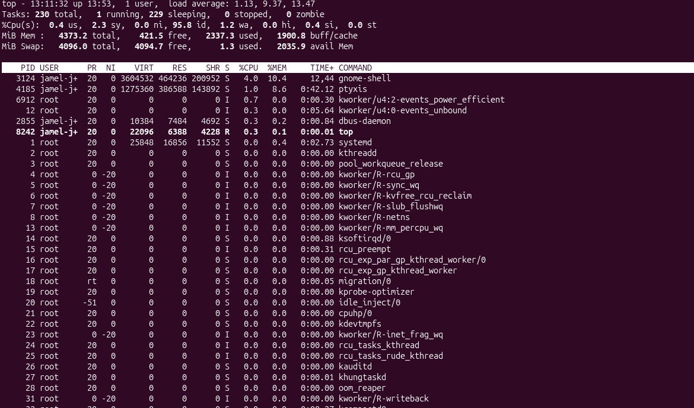

## Day 5 Processes and System Monitoring

##Commands learned

ps
ps aux
top

## What I did
-viewed running processes
-Examined system resource usage
-Used top to monitor the systme

## What I learned
ps
-Displays running process
ps aux
-Displays all running 
-Shows CPU and memory usage
top
-Displays live system information
-Shows active processes resource usage

##  Screenshots

