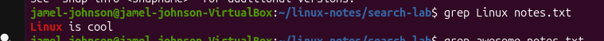
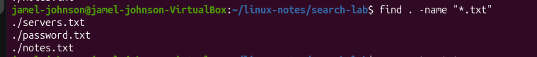

## Day 6 - Finding files and Searching text

## Commands learned
-find
-grep

## What I did
-Created a search lab
-Created multiple text files
-Searched for files using find
-Searched inside of file using grep

## What I learned
find
-Searches for files and directories
-can search by file name

grep
-Searches for text inside files
-Displays matching lines

## Screenshots

