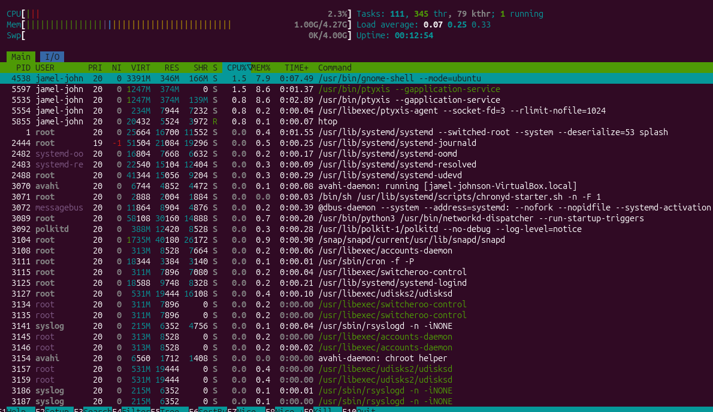

# Review day

# Commands Used
pwd
ls
cd
mkdir
touch
nano
find
grep
chmod
whoami
id
ps aux
htop

## What I Did

-Reviewed commands from day 1 - day 6
-Created files and directories
-Searched for files
-Searched in files
-changed file permissions
-Monitored running processes

## What I reviewed

-Navigating linux directories using terminal commands
-Creating and editing files
-Searching for files using find
-Search contents inside of files using grep
-Modifying permissions using chmod
- Monitoring processes using ps and htop

## Screenshots

