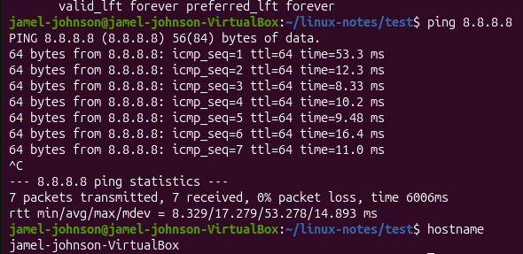

## Day 8 - Networking Basics

## Commands learned
ip a
ping
hostname

## What I did
-Checked my network interfaces using ip a
 -Found my Ubuntu VM's ip address
-tested network connectivity using ping
-Checked system hostname

#What I learned
ip a
-Displays ip address
-Shows wheter an interface is up or down

ping
-Tests if another device or website can be reached
-Helps troubleshoot internet or network problems

hostname
-Shows the name of computer/system

#Screenshots

