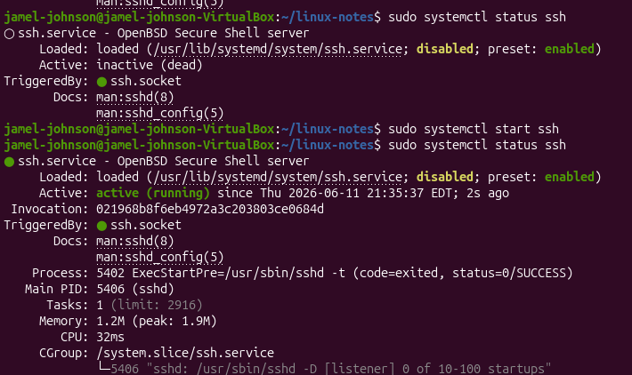

## Day 9 - SSH (Secure Shell)

## Commands Learned
sudo apt install openssh-server
sudo systemctl status ssh
ip a
ssh username@ip-address

# What I did
-Installed OpenSSH server
-Verified the SSH service was running
-Found my system ip address
-learned how remote connections work

## What I learned
SSH
 -Secure shell allows remote access to Linux systems

openssh-server
 -Provides SSH services to other devices

systemctl status ssh
 -Verifies that the SSH service is running

ssh username@ip-address
 -Connects to a remote Linux system

## Screenshots

